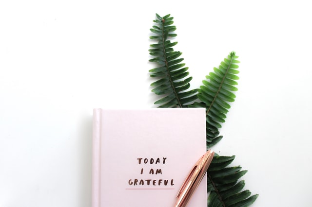
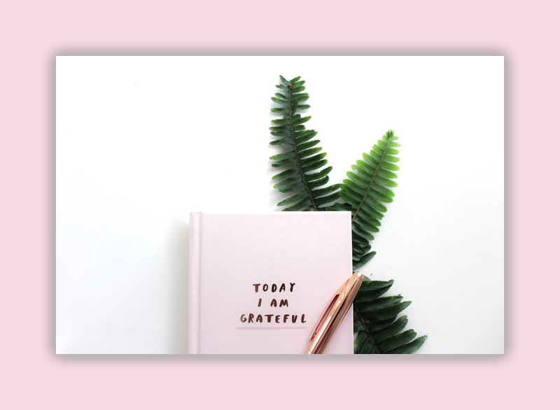
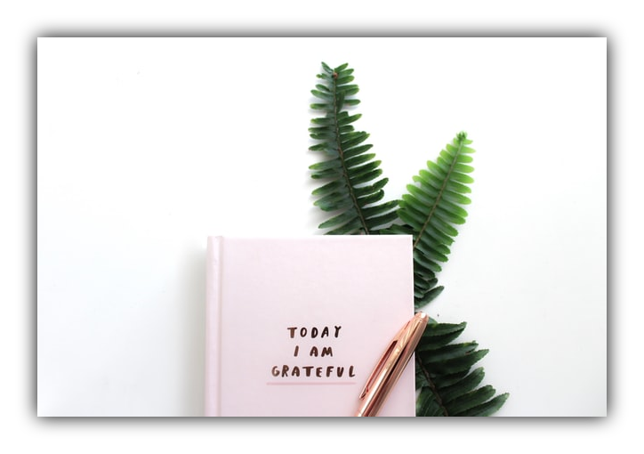

# Pretty Pixels
---

Pretty Pixels is a command line tool written in Python that allows you to add drop shadows to your images. Users can set the amount of blur for the shadow (which also increases the size of the shadow), a background color in case you do not want a transparent background as well as a specific border size.

---
## Usage:
Pretty Pixels can be called from the command line. A GUI is in work. The usage is rather straight forward. When in doubt, you can call the help with `pixels.exe -h`. Pretty Pixels takes `input` and `output` as positional arguments (they are obviously necessary to work). You can set the amount of blur (`-b`, `--blur`) as integer, the background color (`-c`, `--bgcolor`) as hexcode as string (e.g. `#ffffff` for white) and the border size (`-s`, `--bordersize`) in pixels as integer.

Warning: if you want to create a transparent background, saving it as *.png is mandatory. A *.png file with a transparent background will be saved with an alpha channel for transparency. You can read more about the alpha channel [here](https://en.wikipedia.org/wiki/Alpha_compositing) (Wikipedia).

```bash
prettypixels.exe -h
usage: main.py [-h] [-b BLUR] [-c BGCOLOR] [-s BORDERSIZE] input output

Prettify your images by adding a smooth drop shadow and a custom background!

positional arguments:
  input                 Path to input image.
  output                Path for output image.

options:
  -h, --help            show this help message and exit
  -b BLUR, --blur BLUR  Blur amount. Depending on the image size, choose a higher or lower value.
  -c BGCOLOR, --bgcolor BGCOLOR
                        Background color as hexcode. Defaults to a transparent background (as RGBA *.png).
  -s BORDERSIZE, --bordersize BORDERSIZE
                        Border size in pixels. Defaults to roughly 10 percent of the height.
```
---
## Examples:
<p align="center">
  
</p>

`.\prettypixels.exe .\notebook.jpg .\notebook_background.png -b 10 -c "#F6DAE4" -s 80` 

will result in:

<p align="center">

</p>

If you want a transparent background, just leave the bordersize blank:

 `.\prettypixels.exe .\notebook.jpg .\notebook_01.png -b 10` 
 
 will give you:

<p align="center">

</p>


The used image is from Gabrielle Henderson on [Unsplash.com](https://unsplash.com/photos/Y3OrAn230bs).

---
## ToDo:
* OOP it
* Use the avg_rgb function to create a background from the average color of the given image
* Offer sample pastel colors I use myself
* Offer to process entire folders with the same parameters
* Write a GUI

## Why?
I was looking for a command line tool to create drop shadows for my images when using them in presentations. I decided to create an interface for the command line with `argparse` and wrap it up with `pyinstaller` to use it from the command line.
